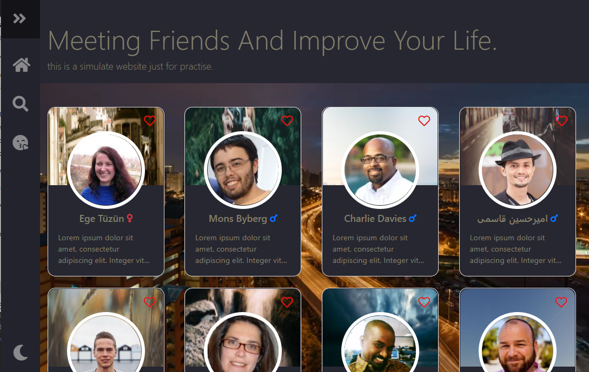
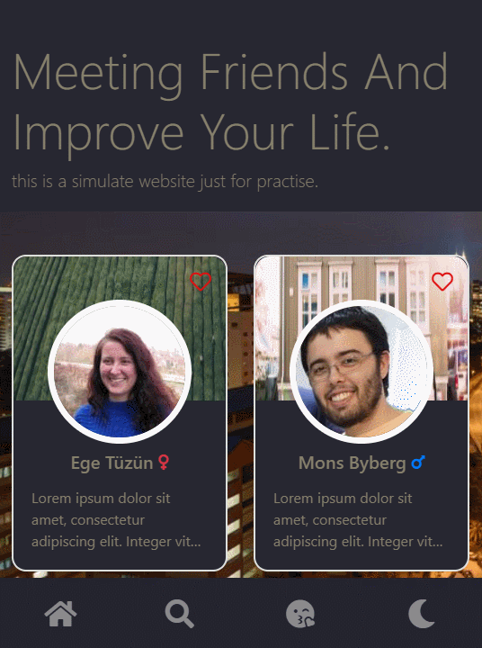

# 簡易交友網站

## 專案說明


* 以Vue.js為框架製作的練習專案。
* 具有RWD、Infinite scroll、axios API串接等功能

<br>

|  branch  |   內容    | 
|----------|----------|
| master   | 專案本體   | 
| gh-pages | build佈署 |

<br>

## 功能描述 (features)
* 交友功能
  - 使用者可以瀏覽120位成員資料
  - 使用者可以將特定成員加入最愛，在最愛頁面瀏覽
  - 使用者可以依照年齡、性別、居住程式篩選成員
* 瀏覽功能
  - 響應式網站功能 (RWD)
  - 提供按鈕讓使用者快速回到頁面頂端
  - 使用Intersection Observer API監控元件，製作無限下拉分頁功能，資料全數顯示後自動解除監控
  - 點選成員顯示modal，可以看到詳細資料
  - 使用者能切換模式，晚上與白天模式 <br> 

<br>

## Components 結構
| 頂層    |                          |                                                 |
|---------|--------------------------|-------------------------------------------------|
| App.vue | Navbar                   |                                                 |
|         | Users (outer-view)       | UserCard、Spinner、Alert、Observer、Jumbotron    |
|         | Favorite (outer-view)    | UserCard、Spinner、Alert                        |
|         | Search (outer-view)      | UserCard、Spinner、Alert、Observer、Searchbar    |
|         | BackToTopBtn             |                                                 |
|         | Modal                    |                                                 |  
  
<br>

## 使用技術、資源

### 技術
|      |  項目  |   項目  |    項目    |   項目      |
|------|--------|--------|------------|-------------|
| 前端 | HTML5  | CSS3   | JavaScript |             |
| 技術 | RWD    | MVC    | AJAX       |             |
| 框架 | Vue    | jQuery | axios      | Bootstrap   |

### 資源
* 使用者API([網址](https://randomuser.me/documentation))
* 使用者 banner([網址](https://picsum.photos/))
* 網站背景([網址](https://www.youtube.com/watch?v=0e4-OsxGrrM&ab_channel=NahokoSaito))
  
<br>

## 安裝與執行步驟 (installation and execution)：
1. 下載Github頁面上內容
```console
git clone https://github.com/coooo77/dating-web
```
2. 啟動Node.js cmd以指令cd移動至dating-web資料夾底下
```console
cd 下載位置/dating-web
```
3. 根據環境建置與需求安裝軟體與套件
```console
npm install
```
4. 啟動專案
```console
npm run serve
```
5. 依照終端顯示，開啟本專案
> [localhost:8000/](https://localhost:8000/)